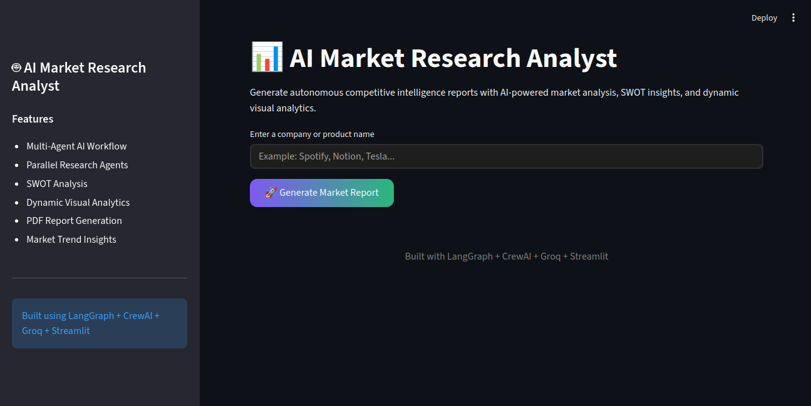
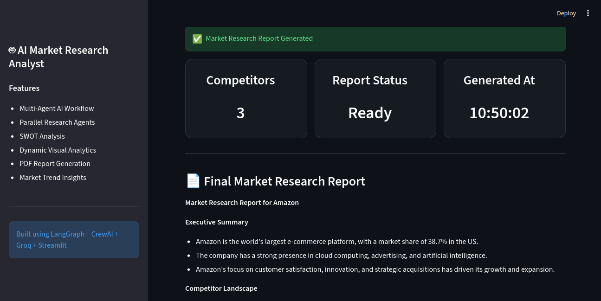
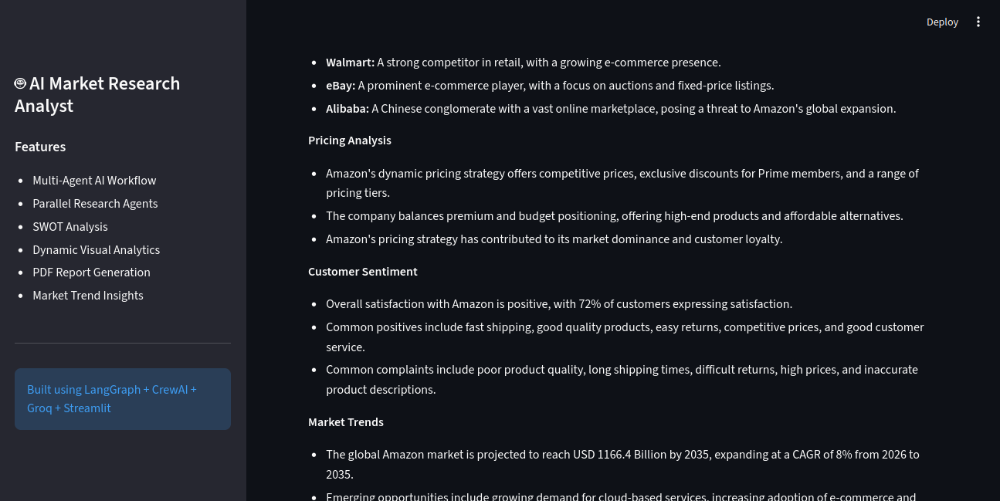
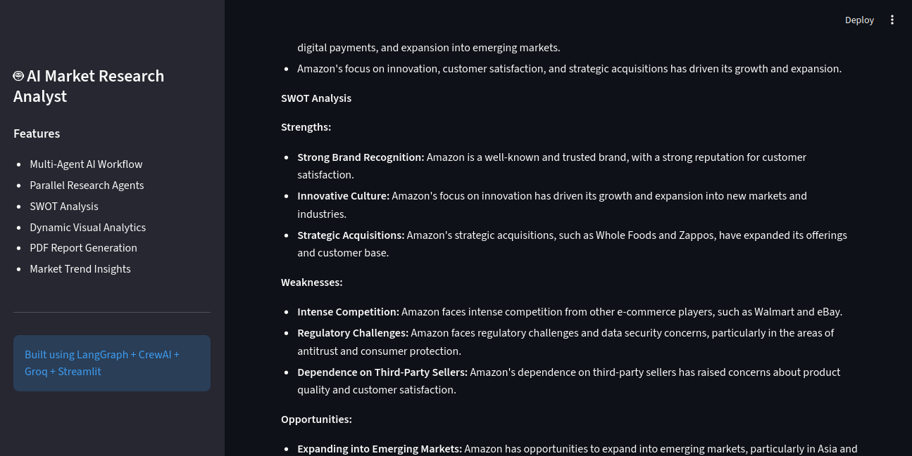
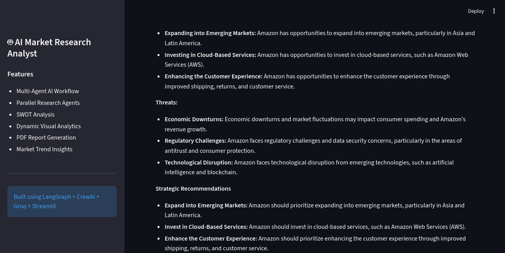
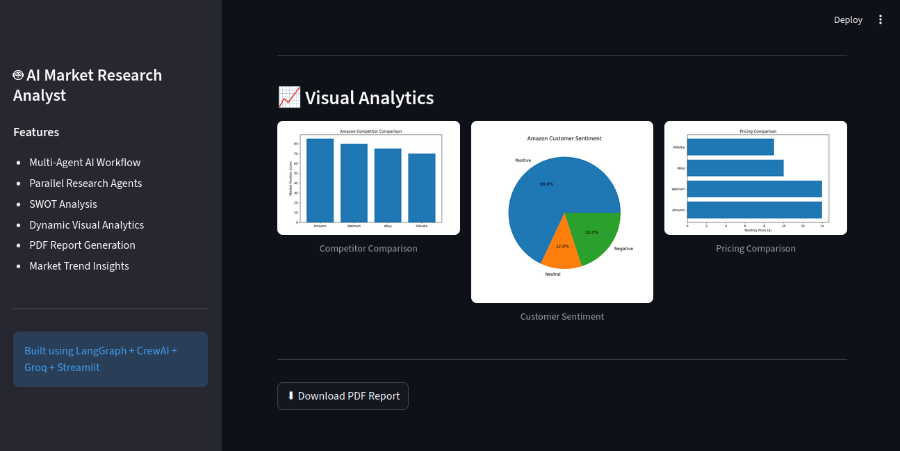
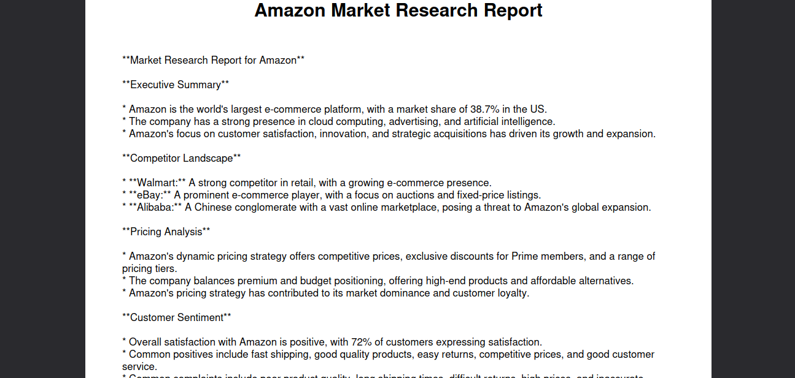

# AI Market Research Analyst

An AI-powered multi-agent market research system that autonomously generates competitive intelligence reports for companies or products using parallel AI agents, real-time web research, SWOT analysis, visual analytics, and downloadable PDF reports.

---

# Live Demo

https://ai-market-research-analyst.onrender.com


# Features

- Multi-agent AI workflow
- Parallel research execution using asyncio
- Competitor analysis
- Pricing insights
- Customer sentiment analysis
- Market trend analysis
- SWOT analysis generation
- Dynamic visual analytics
- Downloadable PDF reports
- Modern Streamlit dashboard UI
- Automated market intelligence generation

---

# Architecture

```text
User Input
    ↓
Parallel Research Agents
    ├── Competitor Agent
    ├── Pricing Agent
    ├── Sentiment Agent
    └── Trend Agent
            ↓
      Analyst Agent
            ↓
       Writer Agent
            ↓
Charts + PDF Generator
            ↓
     Final Report
```

---

# Tech Stack

- Python
- Streamlit
- LangGraph
- CrewAI
- Groq LLM
- Tavily Search API
- Matplotlib
- ReportLab
- Asyncio

---

# Project Structure

```text
ai-market-research-analyst/
│
├── app.py
├── requirements.txt
├── runtime.txt
├── .gitignore
├── README.md
│
├── agents/
│   ├── competitor_agent.py
│   ├── pricing_agent.py
│   ├── sentiment_agent.py
│   ├── trend_agent.py
│   ├── analyst_agent.py
│   └── writer_agent.py
│
├── graph/
│   └── workflow.py
│
├── tools/
│   ├── llm.py
│   ├── web_search.py
│   ├── scraper.py
│   ├── chart_generator.py
│   └── pdf_generator.py
│
├── outputs/
│   ├── charts/
│   └── reports/
```

---

# Installation

Clone the repository:

```bash
git clone <your-repository-url>

cd ai-market-research-analyst
```

Create virtual environment:

```bash
python3 -m venv venv
```

Activate virtual environment:

Linux / Mac:

```bash
source venv/bin/activate
```

Windows:

```bash
venv\Scripts\activate
```

Install dependencies:

```bash
pip install -r requirements.txt
```

---

# Environment Variables

Create a `.env` file in the root directory:

```env
GROQ_API_KEY=your_groq_api_key
TAVILY_API_KEY=your_tavily_api_key
```

---

# Run the Application

```bash
streamlit run app.py
```

---

# Example Workflow

1. User enters a company or product name
2. Parallel AI agents perform:
   - competitor research
   - pricing analysis
   - sentiment analysis
   - trend analysis
3. Analyst agent synthesizes findings
4. Writer agent generates structured report + SWOT analysis
5. Charts are generated dynamically
6. Final PDF report becomes downloadable

---

# Optimization Techniques Used

- Parallel async agent execution
- Reduced token consumption
- Limited web search results for faster runtime
- Lightweight chart rendering
- Optimized PDF generation
- Concise prompt engineering
- Dynamic competitor extraction

---

# Screenshots

## Dashboard UI








## Visual Analytics



## Generated PDF Report


---

# Future Improvements

- Real-time sentiment scoring
- Advanced competitor extraction
- Historical trend tracking
- Database integration
- LLM response caching
- Enhanced chart analytics
- Multi-language report support

---

# Deployment

The project can be deployed using:

- Render
- Streamlit Community Cloud

Recommended platform: Render

---

# Author

Nivetha Renganayagi

---

# License

This project is developed for educational and portfolio purposes.